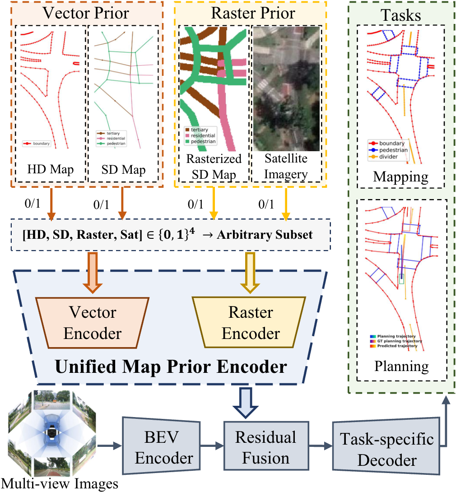
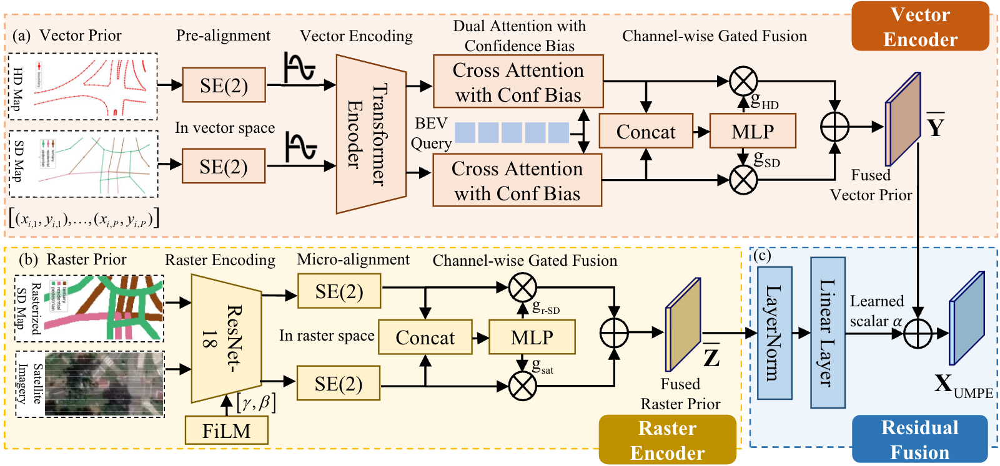
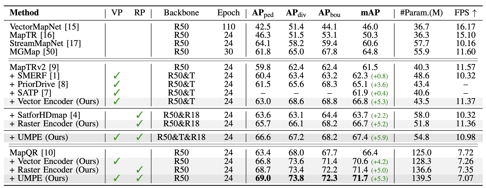
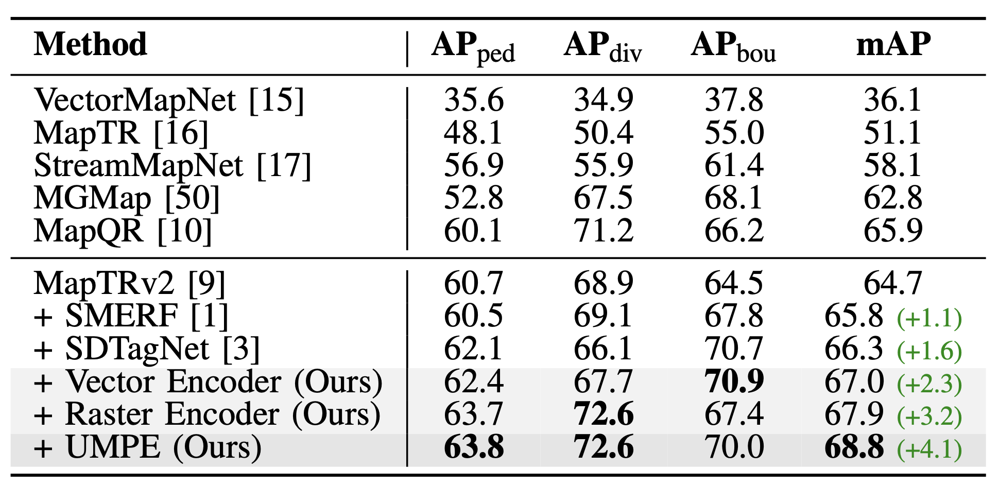
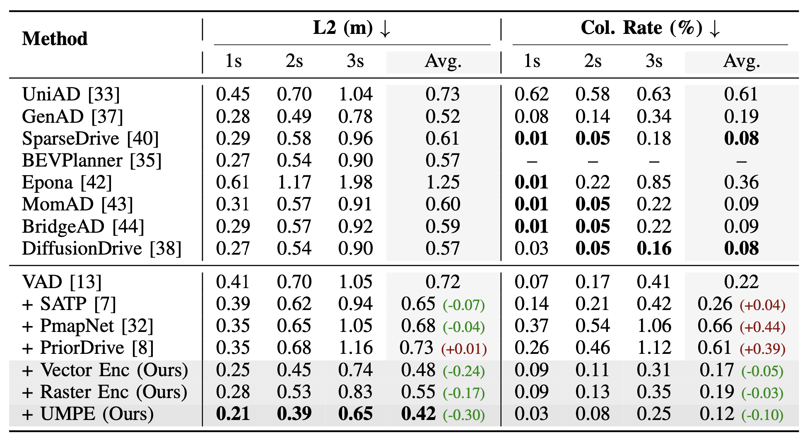

<!-- 

<h2>Unified Map Prior Encoder for Mapping and Planning</h2>

<strong>Submit ICRA 2026 for consideration</strong>

 -->

# Unified Map Prior Encoder for Mapping and Planning

***ICRA 2026 Submission***

<!-- 

Autonomous driving systems underuse rich map priors (HD/SD vectors, rasterized SD maps, satellite imagery) due to heterogeneity and pose drift. We present UMPE, a Unified Map Prior Encoder that ingests any subset of four map types and fuses them with BEV features. UMPE uses a vector encoder with SE(2) alignment and confidence scoring, plus a raster encoder with FiLM conditioning and zero-initialized residual fusion. On nuScenes mapping, UMPE improves MapTRv2 61.5 → 67.4 mAP (+5.9) and MapQR 66.4 → 71.7 mAP (+5.3). For E2E planning, it reduces trajectory error from 0.72 → 0.42 m L2 (avg. −0.30 m) and collision rate from 0.22% → 0.12% (−0.10%). These results show that a unified, alignment-aware treatment of heterogeneous map priors yields better mapping and better planning.

 -->

<table>
<tr>
<td width="60%" valign="top">

<!-- Autonomous driving systems underuse rich map priors (HD/SD vectors, rasterized SD maps, satellite imagery) due to heterogeneity and pose drift. We present UMPE, a Unified Map Prior Encoder that ingests any subset of four map types and fuses them with BEV features. UMPE uses a vector encoder with SE(2) alignment and confidence scoring, plus a raster encoder with FiLM conditioning and zero-initialized residual fusion. 

On nuScenes mapping, UMPE improves MapTRv2 61.5 → 67.4 mAP (+5.9) and MapQR 66.4 → 71.7 mAP (+5.3). For E2E planning, it reduces trajectory error from 0.72 → 0.42 m L2 (avg. −0.30 m) and collision rate from 0.22% → 0.12% (−0.10%). These results show that a unified, alignment-aware treatment of heterogeneous map priors yields better mapping and better planning. -->
Online mapping and end-to-end (E2E) planning
in autonomous driving are still largely sensor-centric, leaving
rich map priors (HD/SD vector maps, rasterized SD maps,
and satellite imagery) underused due to heterogeneity, pose
drift, and inconsistent availability at test time. We present
UMPE, a Unified Map Prior Encoder that can ingest any
subset of four priors and fuse them with BEV features for
both mapping and planning. UMPE has two branches. The
vector encoder **pre-aligns HD/SD polylines** with a **frame-wise SE(2) correction**, encodes points via multi-frequency sinusoidal
features, and produces polyline tokens with confidence scores.
BEV queries then apply cross-attention with confidence bias,
followed by normalized channel-wise gating to avoid length im-
balance and to softly down-weight uncertain sources. The raster
encoder shares a **ResNet-18 backbone conditioned by FiLM (scaling/shift at every stage)**, performs **SE(2) micro-alignment**,
and injects priors through **zero-initialized residual fusion** so
the network starts from a do-no-harm baseline and learns
to add only useful prior evidence. A vector-then-raster fusion
order reflects the inductive bias of “geometry first, appearance
second.” On nuScenes mapping, UMPE lifts MapTRv2 from
**61.5 → 67.4 mAP (+5.9)** and MapQR from **66.4 → 71.7 mAP (+5.3)**. On Argoverse2, UMPE adds +4.1 mAP over strong
baselines. UMPE is compositional: when trained with all priors,
it outperforms single-prior models even when only one prior
is available at test time, demonstrating powerset robustness.
For E2E planning (VAD backbone, nuScenes), UMPE reduces
trajectory error from **0.72 → 0.42 m L2 (avg. −0.30 m)** and
collision rate from **0.22% → 0.12% (−0.10%)**, surpassing recent
prior-injection methods. These results show that a unified,
alignment-aware treatment of heterogeneous map priors yields
better mapping and better planning. 

</td>
<td width="40%">

</td>
</tr>
</table>

## Overview

UMPE has two branches. The
vector encoder pre-aligns HD/SD polylines with a frame-wise
SE(2) correction, encodes points via multi-frequency sinusoidal
features, and produces polyline tokens with confidence scores.
BEV queries then apply cross-attention with confidence bias,
followed by normalized channel-wise gating to avoid length im-
balance and to softly down-weight uncertain sources. The raster
encoder shares a ResNet-18 backbone conditioned by FiLM
(scaling/shift at every stage), performs SE(2) micro-alignment,
and injects priors through zero-initialized residual fusion so
the network starts from a do-no-harm baseline and learns
to add only useful prior evidence. A vector-then-raster fusion
order reflects the inductive bias of “geometry first, appearance
second.”

## Our results
**MAPPING RESULTS ON NUSCENES VALIDATION DATASET**

**MAPPING RESULTS ON ARGOVERSE 2 VALIDATION DATASET**  

  

**PLANNING RESULTS ON NUSCENES VALIDATION DATASET**  

  

## Getting Started
- [Environment Setup](docs/env.md)
- [Prepare Dataset](docs/prepare_dataset.md)
- [Mapping Train and Eval](docs/map.md)
- [E2E planning Train and Eval](docs/planning.md)
- [Visualization](docs/vis.md)

## Catalog

- [x] Code release
  - [x] MapTRv2
  - [x] MapQR
  - [ ] VAD
- [x] Visualization Code
- [x] Untested version released + Instructions
- [ ] Initialization
- [ ] Checkpoint release

## License

This repository is licensed under [Apache 2.0](LICENSE).

