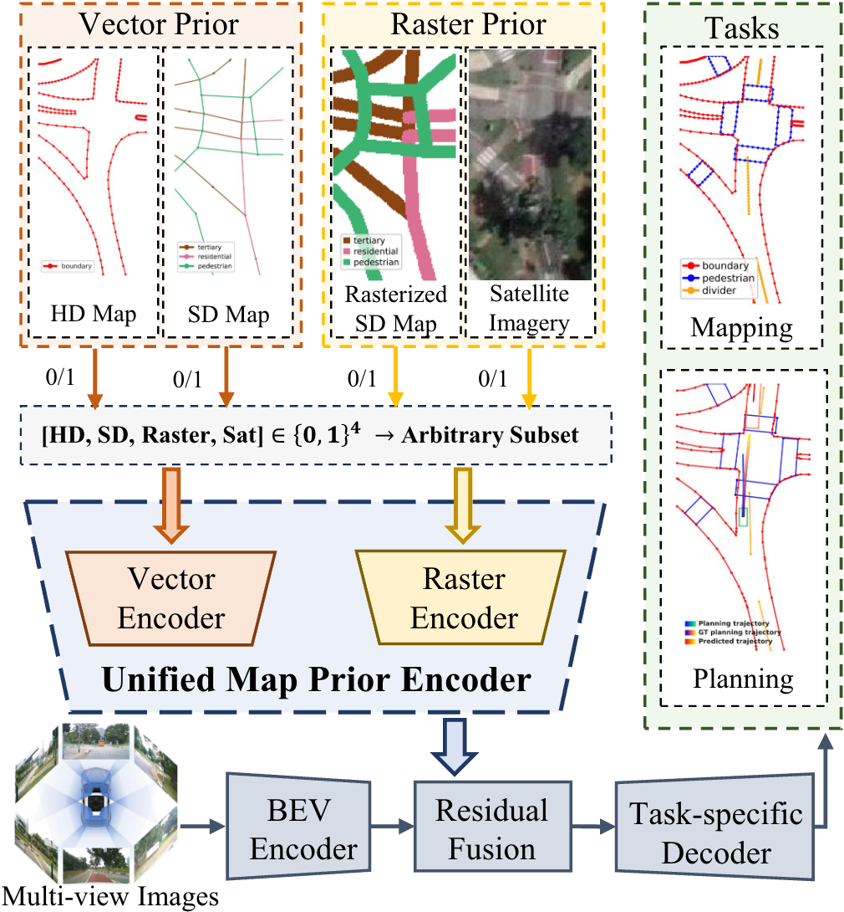
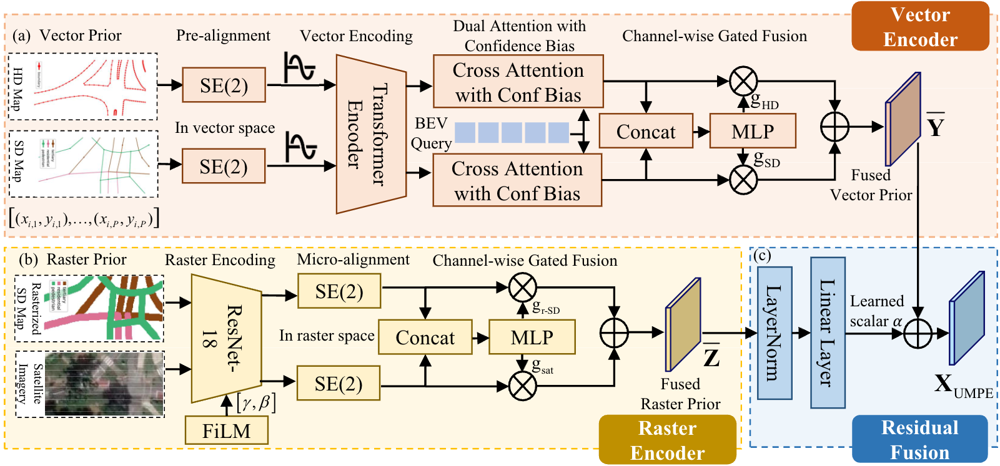
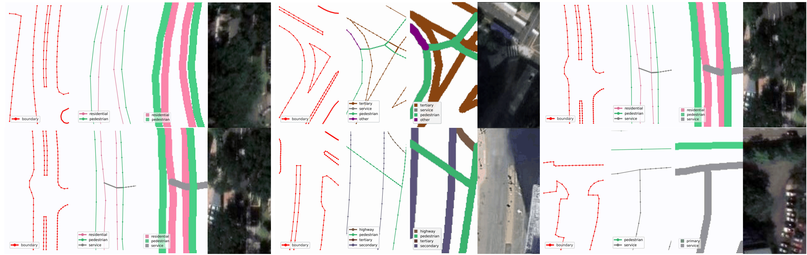
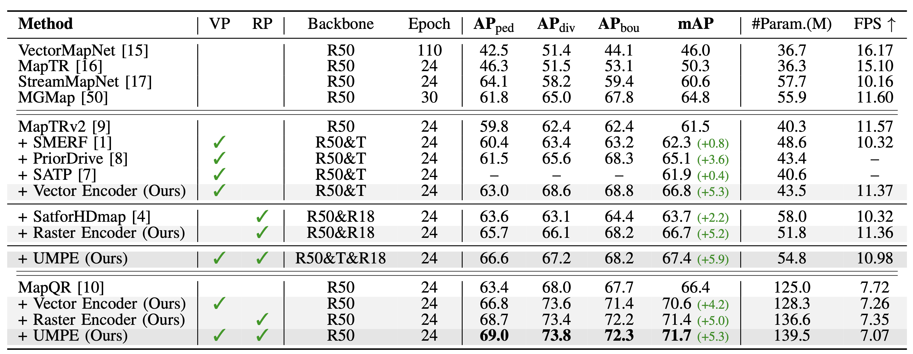
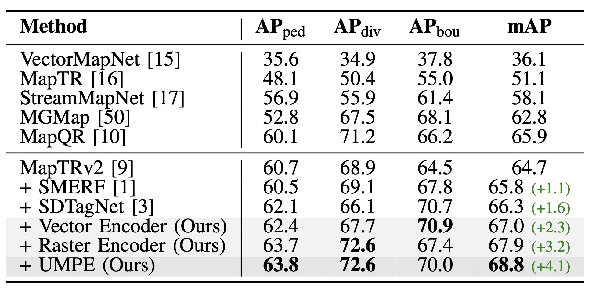
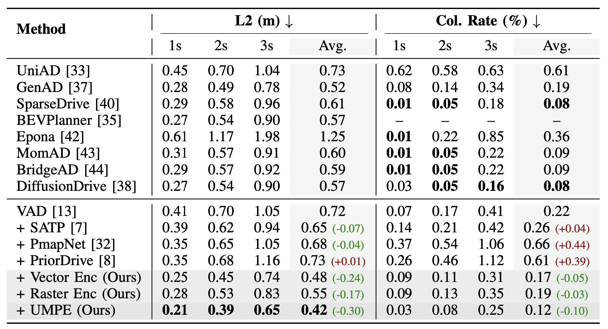

# Unified Map Prior Encoder for Mapping and Planning

***ICRA 2026***

<table>
<tr>
<td width="60%" valign="top">

Online mapping and end-to-end (E2E) planning
in autonomous driving are still largely sensor-centric, leaving
rich map priors (HD/SD vector maps, rasterized SD maps,
and satellite imagery) underused due to heterogeneity, pose
drift, and inconsistent availability at test time. We present
**UMPE**, a Unified Map Prior Encoder that can ingest any
subset of four priors and fuse them with BEV features for
both mapping and planning. UMPE has two branches. The
vector encoder **pre-aligns HD/SD polylines** with a **frame-wise SE(2) correction**, encodes points via multi-frequency sinusoidal
features, and produces polyline tokens with confidence scores.
BEV queries then apply **cross-attention with confidence bias**,
followed by **normalized channel-wise gating** to avoid length im-
balance and to softly down-weight uncertain sources. The raster
encoder shares a **ResNet-18 backbone conditioned by FiLM (scaling/shift at every stage)**, performs **SE(2) micro-alignment**,
and injects priors through **zero-initialized residual fusion** so
the network starts from a do-no-harm baseline and learns
to add only useful prior evidence. A vector-then-raster fusion
order reflects the inductive bias of **“geometry first, appearance second.”** 

</td>
<td width="40%">

</td>
</tr>
</table>

## Overview

UMPE has two branches. The
vector encoder pre-aligns HD/SD polylines with a frame-wise
SE(2) correction, encodes points via multi-frequency sinusoidal
features, and produces polyline tokens with confidence scores.
BEV queries then apply cross-attention with confidence bias,
followed by normalized channel-wise gating to avoid length im-
balance and to softly down-weight uncertain sources. The raster
encoder shares a ResNet-18 backbone conditioned by FiLM
(scaling/shift at every stage), performs SE(2) micro-alignment,
and injects priors through zero-initialized residual fusion so
the network starts from a do-no-harm baseline and learns
to add only useful prior evidence. A vector-then-raster fusion
order reflects the inductive bias of “geometry first, appearance
second.”

## Prior Preparation

  

The prior datasets of nuScenes and Argoverse 2 are obtained manually, which includes vectorized [HD maps](example/hdmap_example.json) and [SD maps](example/sdmap_example.json), [rasterized SD maps](example/rasterized_sdmap.png) and [satellite maps](example/satellite.png). Vectorized HD maps are processed from the primitive dataset records and the official APIs. Vectorized SD maps are obtained through the scripts of SMERF by accessing OpenStreetMap API. Rasterized SD maps are post-processed from SD map polylines by drawing each category on one channel and stacking together. The satellite maps of nuScenes can be found published online, but Argoverse 2 cannot.

  

The satellite imagery of Argoverse 2 is obtained from the OpenSatMap dataset published on Huggingface, which covers the areas of all six cities Argoverse 2 needs. Each of its imagery is spliced with 8 × 8, 64 in total, images, with the center coordinates of each tile provided. So, we can calculate the the WGS84 range each whole imagery covers. Then, with the ego WGS84 coordinates of each timestamp, we could search which imagery every ego pose lies in and crop the corresponding map patch.

## Our results
**MAPPING RESULTS ON NUSCENES VALIDATION DATASET**

**MAPPING RESULTS ON ARGOVERSE 2 VALIDATION DATASET**  

  

**PLANNING RESULTS ON NUSCENES VALIDATION DATASET**  

  

## Getting Started
- [Environment Setup](docs/env.md)
- [Prepare Dataset](docs/prepare_dataset.md)
- [Mapping Train and Eval](docs/map.md)
- [E2E planning Train and Eval](docs/planning.md)
- [Visualization](docs/vis.md)

## Catalog

- [x] Code release
  - [x] MapTRv2
  - [x] MapQR
  - [ ] VAD
- [x] Visualization Code
- [x] Untested version released + Instructions
- [x] Initialization
- [x] Checkpoint release

## License

This repository is licensed under [Apache 2.0](LICENSE).

